<p align="center">
  
</p>

<p align="center">
  <sub>github readme safe terminal: animated image now, full ascii gif when rendered from your source video</sub>
</p>

<details>
  <summary>render the full Bad Apple ASCII terminal GIF</summary>

Put a source video you have rights to use at:

```txt
assets/bad-apple-source.mp4
```

Then run:

```bash
python -m pip install pillow
python scripts/render_bad_apple_ascii.py assets/bad-apple-source.mp4 --out assets/bad-apple-terminal.gif --fps 12 --cols 88
```

After it renders, change the top image to:

```html

```
</details>

<p align="center">
  
</p>

<p align="center">
  
</p>

```txt
suolovesgit@github
-----------------
learning   java
next       spanish
vibe       funny, smart, tsundere
colors     orange + violet
interests  pc building, coding, cute things
```
